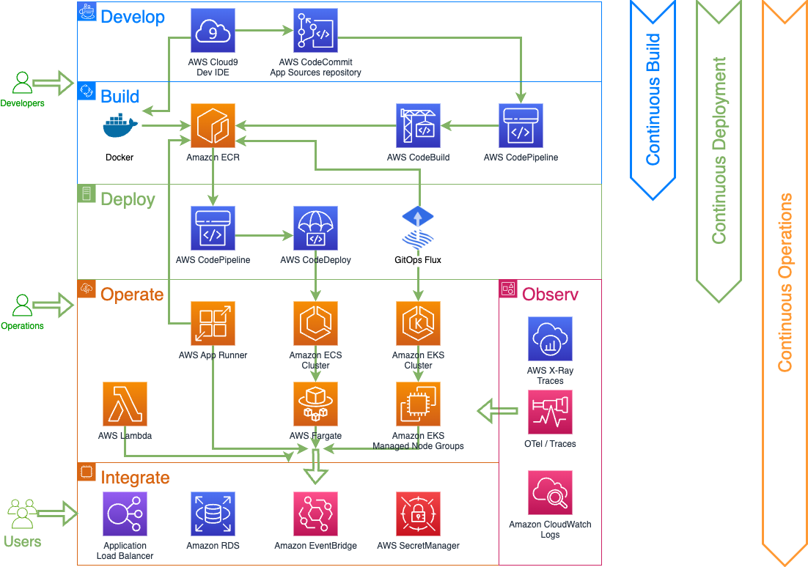

# Java on AWS Immersion Day

This project contains the code for the Java on AWS Immersion Day.
You can find the content and instructions for the Immersion Day [here](https://catalog.workshops.aws/java-on-aws-immersion-day).

You will learn how to build cloud-native Java applications, best practices and performance optimizations techniques and how to migrate your existing Java application to containers and AWS Lambda.

## Security

See [CONTRIBUTING](CONTRIBUTING.md#security-issue-notifications) for more information.

## License

This library is licensed under the MIT-0 License. See the LICENSE file.
