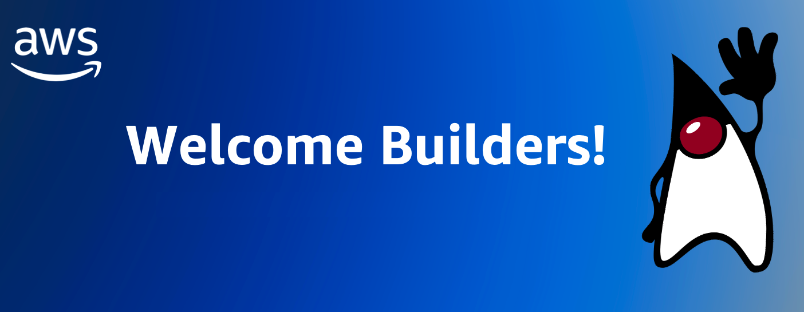
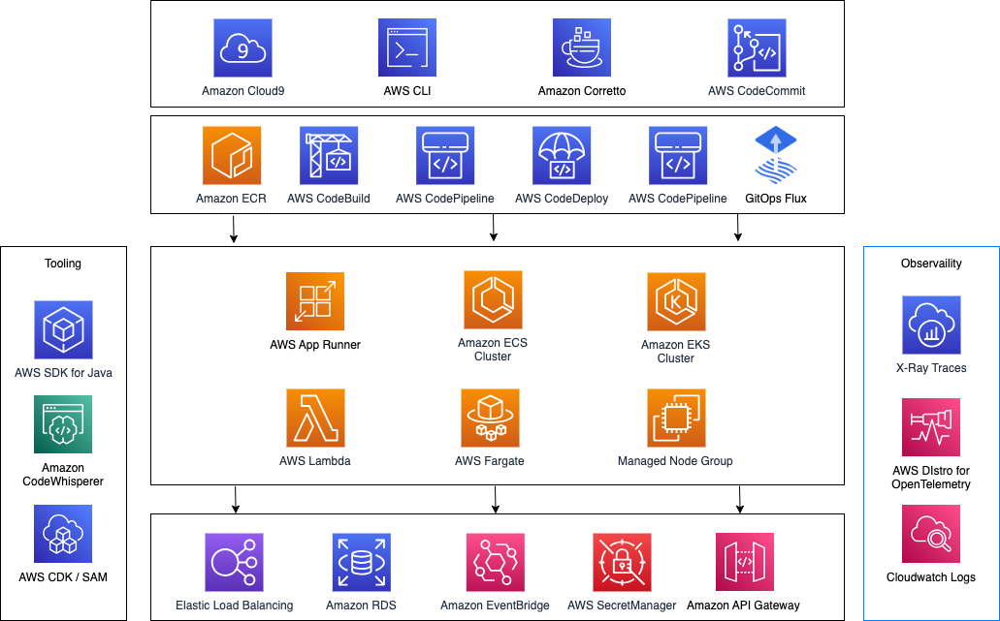
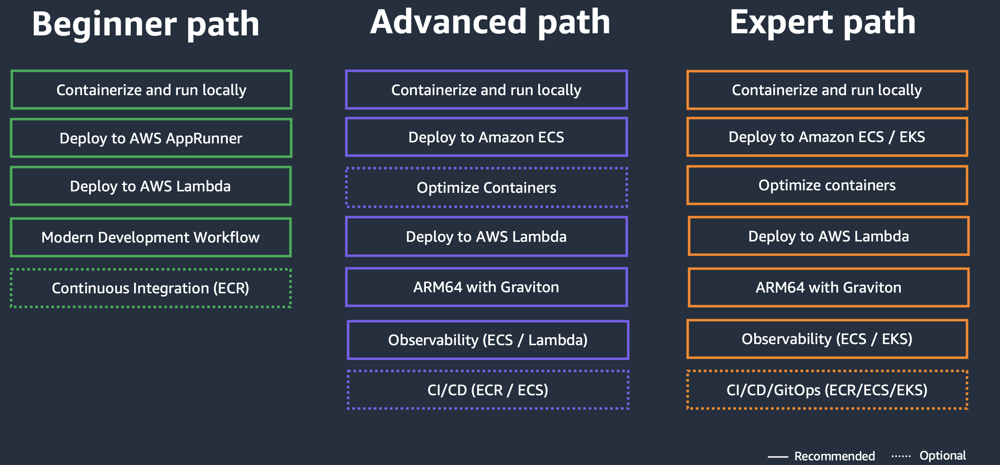

# Java on AWS Immersion Day

This project contains the supporting code for the Java on AWS Immersion Day. You can find the instructions for the hands-on lab here (To be released).

# Overview
In this workshop you will learn how to build cloud-native Java applications, best practices and performance optimizations techniques. You will also learn how to migrate your existing Java application to container services such as AWS AppRunner, Amazon ECS and Amazon EKS or how to to run them as Serverless AWS Lambda functions. Below you can find an overview of the components and services involved.

# Modules and paths
The workshop is structured in multiple independent modules that can be chosen in any kind of order - with a few exceptions that mention a prerequisite of another module. While you can feel free to chose the path to your own preferences, we prepared three example paths through this workshop based on your experience:

#### Containerize and run locally (30 minutes)

- Build a container image locally using Docker.
- Run and test your Java application container locally and optimize your Dockerfile with a multi-stage build.
- Push container images to Amazon Elastic Container Registry (ECR).

#### Deploy a container image to AWS App Runner (30 minutes)

- Deploy your Java application in the cloud.
- Use the AWS Console for the deployment.
- Test your Java app running on AWS App Runner.

#### Deploy a container image to Amazon ECS (30 minutes)

- Deploy your Java application in the cloud with more infrastructure control.
- Use the AWS Console for the deployment.
- Test your Java app running on Amazon ECS.

#### Deploy a container image to Amazon EKS (60 minutes)

- Create a Kubernetes Cluster on AWS using the AWS CLI
- Deploy and test the Java application with Amazon EKS.

#### Optimize Containers (30 minutes)

- Optimize your Dockerfile, build your own optimized JVM or go native with GraalVM

#### Deploy to AWS Lambda (60 minutes)

- Migrate your existing Java application to run on AWS Lambda
- Leverage AWS Lambda SnapStart to drastically reduce Cold-Starts
- Build a new event driven AWS Lambda function in plain Java.

#### ARM64 with AWS Graviton  (30 minutes)

- AWS Graviton processors are designed by AWS to deliver the best price performance for your cloud workloads.
- Understand how to build multi-arch images and leverage AWS Graviton on different compute platforms.

#### Observability (60+ minutes)

- Leverage native AWS services for logging, metrics & tracing.
- Setting up AWS Distro for OpenTelemetry Collector.
- Use manual and automatic instrumentation

#### CI/CD/Gitops (60+ minutes)

- Push you source code to AWS CodeCommit.
- Create a Continuous Integration (CI) pipeline with AWS CodePipeline, AWS CodeCommit and AWS CodeBuild.
- Leverage CodeDeploy for automatically updating your Amazon ECS Service
- User a GitOps approach with Flux to deploy to Amazon EKS
- Automatically build multi-arch container images (x86 + arm)

#### Modern development workflow  (20 minutes)

- Leverage the power of Generative AI on AWS
- Use Amazon CodeWhisperer in your development workflow.

## Security

See [CONTRIBUTING](CONTRIBUTING.md#security-issue-notifications) for more information.

## License

This library is licensed under the MIT-0 License. See the [LICENSE](LICENSE) file.
