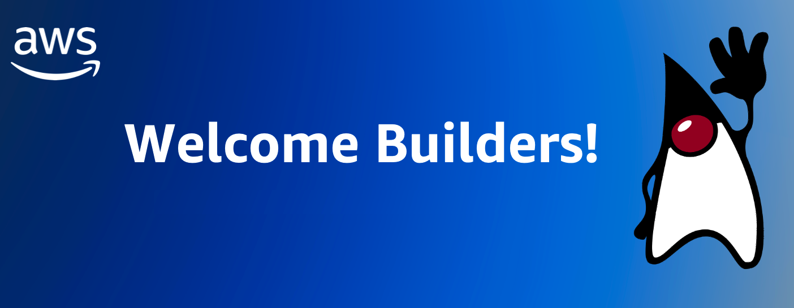

# Java on AWS

Java remains one of the most widely used programming languages, powering millions of applications from startups to enterprises. This repository contains the source code, infrastructure, and samples supporting a family of hands-on workshops that cover cloud-native Java on containers and AI agent development on AWS.

## Java on AWS — Containers

**[catalog.workshops.aws/java-on-aws](https://catalog.workshops.aws/java-on-aws)**

Learn how to build, containerize, optimize, and operate Java applications on Amazon EKS and Amazon ECS — from first container to production-grade deployment.

### Container optimization

A core focus of the workshop is reducing startup time, image size, and resource consumption. You'll work through a progression of techniques, measuring the impact of each:

- **Jib** — build images directly to registry without a Dockerfile
- **Custom JRE** — create minimal Java runtimes with jlink
- **SOCI** — lazy-load container images, reducing pull times by up to 70%
- **Class Data Sharing (CDS)** — pre-load classes for faster startup
- **AOT compilation cache** (Java 25+) — ahead-of-time compiled code for reduced warmup
- **GraalVM native image** — compile to native executables with instant startup
- **CRaC** — checkpoint and restore a warmed JVM for sub-second startup
- **Pod Resize** — boost CPU during startup, scale down after (EKS)

### AI-powered JVM analysis

The workshop includes an AI-driven performance analysis module that uses Amazon Bedrock to automate JVM diagnostics:

- Collect and analyze thread dumps automatically from running containers
- Generate flamegraphs with async-profiler
- Get AI-powered performance recommendations based on thread state, lock contention, and resource usage
- Identify bottlenecks and optimization opportunities without manual analysis

### Additional modules

- **Observability** — CloudWatch Application Signals, OpenTelemetry instrumentation, service maps, logs, metrics, and traces
- **Graviton/ARM64** — build multi-architecture images and deploy to AWS Graviton for up to 40% better price-performance

## Building Java AI Agents with Spring AI

**[catalog.workshops.aws/java-spring-ai-agents](https://catalog.workshops.aws/java-spring-ai-agents)**

Build AI agents with Spring AI and Amazon Bedrock. This workshop covers the full journey from a simple chat application to a production-ready agent with memory, knowledge bases, tool calling, and MCP integration.

- Integrate foundation models into Java applications using Spring AI
- Implement conversation memory for stateful interactions
- Ground model responses in your own data using knowledge bases
- Enable tool calling for real-time information access
- Integrate external APIs using Model Context Protocol (MCP)
- Deploy AI agents to AWS infrastructure

## Building Java AI Agents with Spring AI and Amazon Bedrock AgentCore

**[catalog.workshops.aws/java-spring-ai-agentcore](https://catalog.workshops.aws/java-spring-ai-agentcore)**

Extends the Spring AI workshop with Amazon Bedrock AgentCore — an agentic platform for deploying and operating AI agents at scale. Deploy to AgentCore Runtime (serverless), add persistent memory, browser automation, sandboxed code execution, and API gateway integration.

- Deploy agents to AgentCore Runtime with session isolation and fast cold starts
- Add short-term and long-term memory with AgentCore Memory
- Automate web interactions with AgentCore Browser
- Execute code safely with AgentCore Code Interpreter
- Convert APIs into MCP-compatible tools with AgentCore Gateway

## Spring AI AgentCore Starter

**[github.com/spring-ai-community/spring-ai-agentcore](https://github.com/spring-ai-community/spring-ai-agentcore)**

An AWS-initiated, community-maintained set of Spring Boot starters that integrate Amazon Bedrock AgentCore services with Spring AI. Each module provides auto-configuration — add the dependency and configure properties, and the corresponding beans are ready to use.

- `spring-ai-agentcore-runtime-starter` — serverless deployment to AgentCore Runtime
- `spring-ai-agentcore-memory` — conversation memory with short-term and long-term advisors
- `spring-ai-agentcore-browser` — browser automation tools as a `ToolCallbackProvider`
- `spring-ai-agentcore-code-interpreter` — sandboxed code execution tools as a `ToolCallbackProvider`

## Contributing

See [CONTRIBUTING](CONTRIBUTING.md#security-issue-notifications) for more information.

## License

This library is licensed under the MIT-0 License. See the [LICENSE](LICENSE) file.
