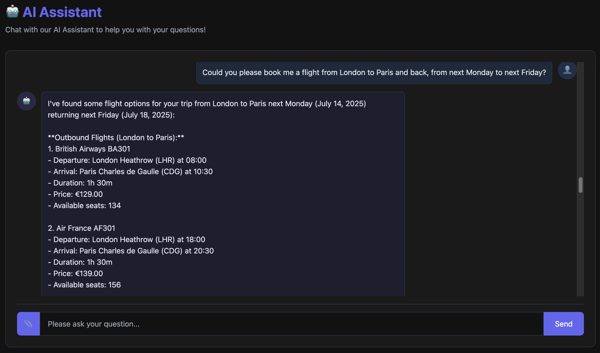
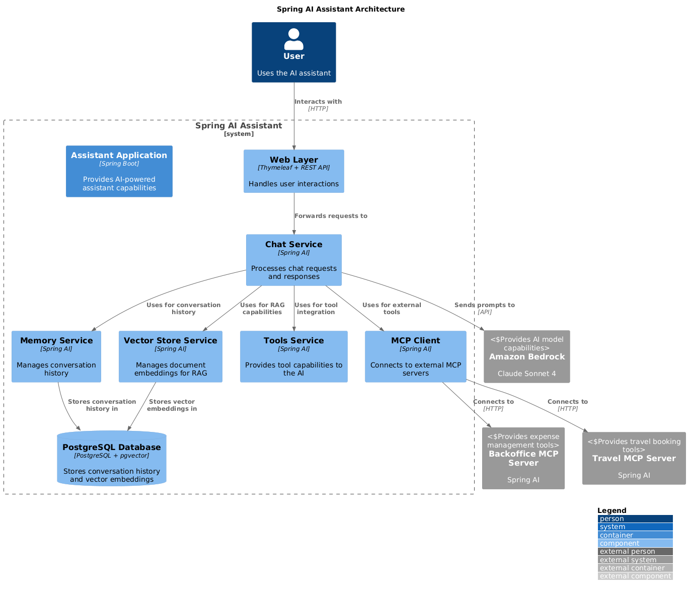
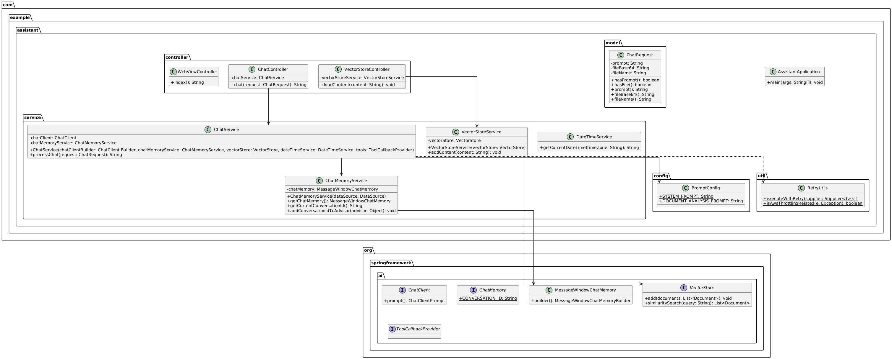

# Spring AI Office Assistant

A comprehensive AI-powered office assistant built with Spring AI framework, featuring multimodal chat capabilities, document analysis, RAG (Retrieval-Augmented Generation), persistent memory, and tool integration.

## Related Documentation

This project is part of a larger microservices ecosystem:

- [Travel Service Documentation](../travel/README.md) - Travel booking service with hotel and flight management
- [Backoffice Service Documentation](../backoffice/README.md) - Expense management and currency conversion service
- [Database Infrastructure Documentation](../database/README.md) - Shared PostgreSQL database with pgvector extension

## Project Overview

### Description

The Spring AI Office Assistant is a demonstration of how to build modern AI-powered applications using the Spring AI framework. It provides a complete set of capabilities for interacting with AI models, including:

- Text-based conversations with persistent memory
- Document analysis (PDF, JPG, JPEG, PNG)
- Retrieval-Augmented Generation (RAG) for knowledge base integration
- Tool integration for enhanced capabilities
- Model Context Protocol (MCP) client for connecting to external services

The application serves as the central component in a microservices architecture, connecting to specialized services like the Travel and Backoffice applications through the Model Context Protocol (MCP).

### Purpose

This application serves as:

1. A reference implementation for Spring AI integration in enterprise applications
2. A demonstration of key AI application patterns (RAG, memory, tools, MCP)
3. A practical example of building AI assistants with Spring Boot
4. A showcase for integrating with Amazon Bedrock and other AI services

### Technology Stack

- **Java 21**: Latest LTS version with modern language features
- **Spring Boot 3.5.3**: Core framework for building the application
- **Spring AI 1.0.0**: AI integration framework
- **Amazon Bedrock**: AI model provider (Claude Sonnet 4)
- **PostgreSQL**: Database with pgvector extension for vector operations
- **Thymeleaf**: Server-side templating for the web interface
- **Docker**: Containerization for database and application



## Architecture

### Component Architecture



### Class Diagram



## Getting Started

### Prerequisites

- Java 21 or higher
- Maven 3.8 or higher
- Docker and Docker Compose
- PostgreSQL with pgvector extension (provided via Docker)
- AWS account with Amazon Bedrock access

### Database Setup

The application requires a PostgreSQL database with the pgvector extension. A Docker Compose setup is provided in the [`database`](../database/README.md) directory.

```bash
cd samples/spring-ai/database/
./start-postgres.sh
```

This script will:
- Start PostgreSQL with pgvector extension
- Initialize the assistant_db database
- Start pgAdmin web interface for database management
- Display connection information

For more details on the database infrastructure, see the [Database Documentation](../database/README.md).

### AWS Configuration

1. Configure AWS credentials:
   ```bash
   aws configure
   ```

2. Ensure you have access to Amazon Bedrock and the required models (Claude Sonnet 4).

### Building and Running the Application

1. Build the application:
   ```bash
   cd samples/spring-ai/assistant/
   mvn clean package
   ```

2. Run the application:
   ```bash
   mvn spring-boot:run
   ```

3. The application will be available at:
   ```
   http://localhost:8080
   ```

## Key Spring AI Features

This project demonstrates key features of the [Spring AI framework](https://docs.spring.io/spring-ai/reference/index.html). For comprehensive documentation, refer to the [Spring AI Reference Guide](https://docs.spring.io/spring-ai/reference/index.html).

### System Prompt Configuration

Spring AI allows you to define [system prompts](https://docs.spring.io/spring-ai/reference/api/clients/prompt-template.html) that set the behavior and capabilities of the AI assistant. The system prompt is configured in the `PromptConfig` class:

```java
public static final String SYSTEM_PROMPT = """
    You are a helpful and honest AI Assistant for our company.
    You can help with questions related to policies and procedures.
    Follow these guidelines strictly:
    1. ACCURACY FIRST: Only provide information you are confident about based on your training data.
    2. ADMIT UNCERTAINTY: If you are unsure about any fact, detail, or answer, respond with "I don't know" or "I'm not certain about that."
    3. NO SPECULATION: Do not guess, speculate, or make up information. It's better to say "I don't know" than to provide potentially incorrect information.
    4. PARTIAL KNOWLEDGE: If you know some aspects of a topic but not others, clearly state what you know and what you don't know.
    5. SOURCES: Do not claim to have access to real-time information, current events after your training cutoff, or specific databases unless explicitly provided.
    Example responses:
    - "I don't know the current stock price of that company."
    - "I'm not certain about the specific details of that recent event."
    - "I don't have enough information to answer that question accurately."
    Remember: Being honest about limitations builds trust. Always choose "I don't know" over potentially incorrect information.
    """;
```

The system prompt is applied when building the ChatClient:

```java
this.chatClient = chatClientBuilder
    .defaultSystem(PromptConfig.SYSTEM_PROMPT)
    // other configuration
    .build();
```

### Chat Memory Integration

Spring AI provides built-in support for [persistent chat memory](https://docs.spring.io/spring-ai/reference/api/clients/chat-memory.html), allowing the assistant to remember conversation history. This is implemented in the `ChatMemoryService`:

```java
public ChatMemoryService(DataSource dataSource) {
    var chatMemoryRepository = JdbcChatMemoryRepository.builder()
        .dataSource(dataSource)
        .dialect(new PostgresChatMemoryRepositoryDialect())
        .build();

    this.chatMemory = MessageWindowChatMemory.builder()
        .chatMemoryRepository(chatMemoryRepository)
        .maxMessages(20)
        .build();
}
```

The memory is integrated with the ChatClient using the MessageChatMemoryAdvisor:

```java
this.chatClient = chatClientBuilder
    // other configuration
    .defaultAdvisors(
        MessageChatMemoryAdvisor.builder(chatMemoryService.getChatMemory()).build(),
        // other advisors
    )
    .build();
```

### RAG (Retrieval-Augmented Generation)

Spring AI provides built-in support for [RAG](https://docs.spring.io/spring-ai/reference/api/vectordbs.html), allowing the assistant to retrieve relevant information from a vector database. This is implemented using the VectorStore and QuestionAnswerAdvisor:

```java
this.chatClient = chatClientBuilder
    // other configuration
    .defaultAdvisors(
        // other advisors
        QuestionAnswerAdvisor.builder(vectorStore).build()
    )
    .build();
```

Documents can be added to the vector store using the VectorStoreService:

```java
public void addContent(String content) {
    vectorStore.add(List.of(new Document(content)));
}
```

### Tool Integration

Spring AI supports [tool integration](https://docs.spring.io/spring-ai/reference/api/clients/tools.html), allowing the assistant to call external functions. Tools are defined using the @Tool annotation:

```java
@Tool(description = """
    Get the current date and time in the specified timezone.
    Requires: timeZone - A valid timezone ID (e.g., 'UTC', 'America/New_York', 'Europe/London').
    Returns: The current date and time in ISO format (YYYY-MM-DDTHH:MM:SS).
    Errors: ILLEGAL_ARGUMENT if the timezone ID is invalid.
    Note: For future dates, use getCurrentDateTime and calculate the future date based on the current date.
    """)
public String getCurrentDateTime(String timeZone) {
    return java.time.ZonedDateTime.now(java.time.ZoneId.of(timeZone))
            .format(DateTimeFormatter.ISO_LOCAL_DATE_TIME);
}
```

Tools are integrated with the ChatClient:

```java
this.chatClient = chatClientBuilder
    // other configuration
    .defaultTools(dateTimeService)
    .build();
```

### MCP (Model Context Protocol) Integration

Spring AI supports the [Model Context Protocol](https://docs.spring.io/spring-ai/reference/api/clients/mcp.html), allowing the assistant to connect to external services. The MCP client is configured in the application.properties:

```properties
# MCP Client Configuration
spring.ai.mcp.client.toolcallback.enabled=true
spring.ai.mcp.client.sse.connections.server1.url=http://localhost:8081
spring.ai.mcp.client.sse.connections.server2.url=http://localhost:8082
```

The MCP client is integrated with the ChatClient:

```java
this.chatClient = chatClientBuilder
    // other configuration
    .defaultToolCallbacks(tools)
    .build();
```

## Microservices Integration

The assistant is designed to work with other microservices in the ecosystem through the MCP protocol.

### Travel Service Integration

The assistant connects to the [Travel service](../travel/README.md) through the MCP protocol, allowing it to:

1. Search for hotels and flights
2. Book accommodations and transportation
3. Get weather forecasts for destinations

The Travel service exposes its functionality through MCP tools, which the assistant can call directly.

### Backoffice Service Integration

The assistant connects to the [Backoffice service](../backoffice/README.md) through the MCP protocol, allowing it to:

1. Create and manage expenses
2. Convert currencies
3. Access company policies and procedures

The Backoffice service exposes its functionality through MCP tools, which the assistant can call directly.

## Web Interface

The application provides a web interface built with Thymeleaf and Tailwind CSS, allowing users to:

1. Chat with the AI assistant
2. Upload documents for analysis
3. View conversation history
4. Add content to the knowledge base

## Configuration

### Application Properties

```properties
# Amazon Bedrock Configuration
spring.ai.bedrock.aws.region=us-east-1
spring.ai.bedrock.converse.chat.options.max-tokens=10000
spring.ai.bedrock.converse.chat.options.model=us.anthropic.claude-3-7-sonnet-20250219-v1:0

# PostgreSQL Configuration
spring.datasource.url=jdbc:postgresql://localhost:5432/assistant_db
spring.datasource.username=postgres
spring.datasource.password=postgres
spring.datasource.driver-class-name=org.postgresql.Driver

# JDBC Memory properties
spring.ai.chat.memory.repository.jdbc.initialize-schema=always

# RAG Configuration
spring.ai.model.embedding=bedrock-titan
spring.ai.bedrock.titan.embedding.model=amazon.titan-embed-text-v2:0
spring.ai.bedrock.titan.embedding.input-type=text

spring.ai.vectorstore.pgvector.initialize-schema=true
spring.ai.vectorstore.pgvector.dimensions=1024

# MCP Client Configuration
spring.ai.mcp.client.toolcallback.enabled=true
spring.ai.mcp.client.sse.connections.server1.url=http://localhost:8081
spring.ai.mcp.client.sse.connections.server2.url=http://localhost:8082
```

## Best Practices

### AI Integration Best Practices

1. **System Prompts**: Use clear, specific system prompts to guide the AI's behavior
2. **Memory Management**: Limit memory size to prevent token overflow
3. **Error Handling**: Implement retry logic for API throttling and failures
4. **Tool Integration**: Provide detailed descriptions for tools to ensure proper use
5. **RAG Implementation**: Use appropriate chunk sizes and overlap for document indexing

### Spring AI Best Practices

1. **ChatClient Builder**: Use the builder pattern for configuring the ChatClient
2. **Advisors**: Use advisors to extend the ChatClient's capabilities
3. **Tool Annotations**: Use detailed descriptions in @Tool annotations
4. **Vector Store**: Use appropriate dimensions and similarity metrics for your embeddings
5. **MCP Integration**: Use the MCP protocol for microservices integration

## Future Enhancements

- Add user authentication and authorization
- Implement fine-tuning for domain-specific knowledge
- Add support for more document types
- Implement streaming responses
- Add support for more AI models
- Enhance the web interface with real-time updates

## Contributing

Contributions are welcome! Please feel free to submit a Pull Request.

## License

This project is licensed under the MIT License - see the LICENSE file for details.
