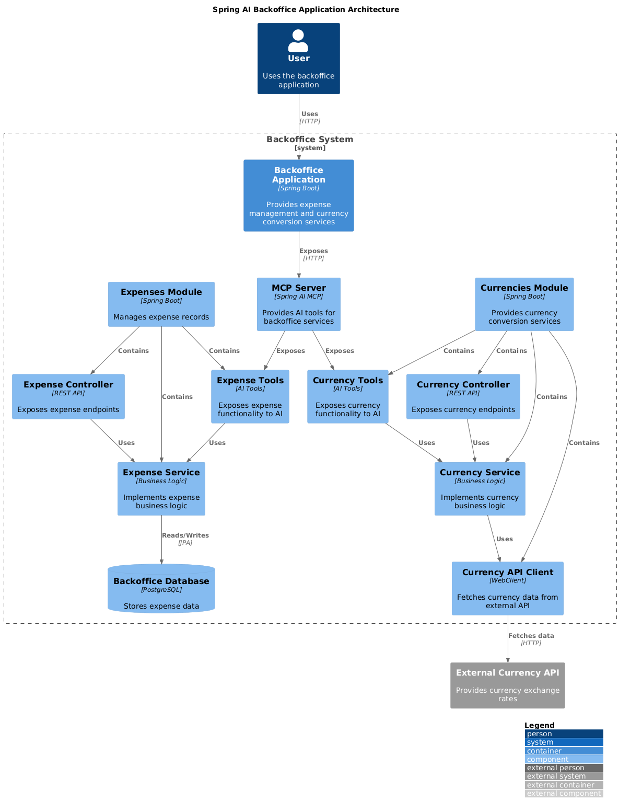
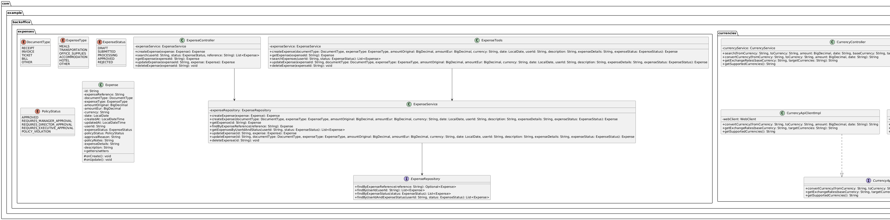
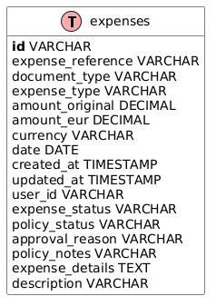

# Spring AI Backoffice Application

A comprehensive backoffice management application built with Spring Boot and Spring AI, providing expense management and currency conversion capabilities with AI-powered assistance through Model Context Protocol (MCP).

## Project Overview

### Description

The Spring AI Backoffice Application is a demonstration of how to build modern backoffice services with AI integration. It provides a complete set of APIs for managing business operations including:

- Expense management (create, track, update, and approve expenses)
- Currency conversion with real-time exchange rates
- AI-powered assistance for expense and currency operations

The application follows Domain-Driven Design (DDD) principles and showcases best practices for building Spring Boot applications with AI capabilities.

### Purpose

This application serves as:

1. A reference implementation for Spring AI integration in business applications
2. A demonstration of Model Context Protocol (MCP) for extending AI capabilities
3. A practical example of domain-driven design in a backoffice domain
4. A showcase for building modular, maintainable Spring Boot applications

### Technology Stack

- **Java 21**: Latest LTS version with modern language features
- **Spring Boot 3.5.7**: Core framework for building the application
- **Spring AI 1.0.3**: AI integration with Model Context Protocol (MCP)
- **Spring Data JPA**: Data access layer with Hibernate
- **PostgreSQL**: Database for storing expense data
- **Testcontainers 1.21.3**: Automatic database container management for development and testing
- **Spring WebFlux**: Reactive programming for external API calls
- **Docker**: Containerization for database and application

## Quick Start

```bash
# Clone and navigate to the project
cd backoffice/

# Run with automatic PostgreSQL container
mvn spring-boot:test-run

# Application available at http://localhost:8081
```

## Getting Started

### Prerequisites

- Java 21 or higher
- Maven 3.8 or higher
- Docker (for Testcontainers - PostgreSQL is automatically managed)
- No manual PostgreSQL setup required

### Running the Application

The application uses **Testcontainers** for automatic PostgreSQL database management during development. No manual database setup is required.

```bash
cd backoffice/
mvn spring-boot:test-run
```

This will:
- Automatically start a PostgreSQL container using Testcontainers 1.21.3
- Initialize the database with the required schema
- Start the application on http://localhost:8081
- Clean up the container when the application stops

### Testing the API

The project includes test scripts to verify API functionality:

```bash
cd scripts/
./test-api-expenses.sh    # Test expense-related endpoints
./test-api-currencies.sh  # Test currency-related endpoints
```

### Running Tests

Run the test suite with Testcontainers:

```bash
mvn test
```

Tests automatically use Testcontainers to spin up a PostgreSQL database for integration testing.

## Architecture

The application follows a layered architecture with clear separation of concerns:

### Component Architecture



### Class Diagram



### Database Schema



## API Documentation

### Expenses API

#### Create Expense
```
POST /api/expenses
Content-Type: application/json

{
  "documentType": "RECEIPT",
  "expenseType": "MEALS",
  "amountOriginal": 25.50,
  "amountEur": 21.75,
  "currency": "USD",
  "date": "2025-06-30",
  "userId": "user123",
  "expenseStatus": "DRAFT",
  "description": "Business lunch",
  "expenseDetails": "Lunch with client"
}
```
Parameters:
- `documentType`: Type of document (RECEIPT, INVOICE, TICKET, BILL, OTHER)
- `expenseType`: Type of expense (MEALS, TRANSPORTATION, OFFICE_SUPPLIES, ACCOMMODATION, HOTEL, OTHER)
- `amountOriginal`: Original amount of the expense
- `amountEur`: (Optional) Amount in EUR if different from original currency
- `currency`: Currency code (USD, EUR, etc.)
- `date`: Date of the expense in format yyyy-MM-dd
- `userId`: ID of the user who created the expense
- `expenseStatus`: (Optional) Status of the expense (DRAFT, SUBMITTED, PROCESSING, APPROVED, REJECTED)
- `description`: Brief description of the expense
- `expenseDetails`: (Optional) Detailed description of the expense

#### Search Expenses
```
GET /api/expenses/search?userId={userId}&status={status}&reference={reference}
```
Parameters:
- `userId`: (Optional) ID of the user who created the expenses
- `status`: (Optional) Status of the expenses (DRAFT, SUBMITTED, etc.)
- `reference`: (Optional) Unique expense reference code

#### Get Expense by ID
```
GET /api/expenses/{expenseId}
```
Parameters:
- `expenseId`: UUID of the expense

#### Update Expense
```
PUT /api/expenses/{expenseId}
Content-Type: application/json

{
  "documentType": "RECEIPT",
  "expenseType": "MEALS",
  "amountOriginal": 30.00,
  "amountEur": 25.50,
  "currency": "USD",
  "date": "2025-06-30",
  "userId": "user123",
  "expenseStatus": "SUBMITTED",
  "description": "Business lunch - updated",
  "expenseDetails": "Lunch with client and team"
}
```
Parameters:
- Same as Create Expense, plus the expense ID in the URL path

#### Delete Expense
```
DELETE /api/expenses/{expenseId}
```
Parameters:
- `expenseId`: UUID of the expense to delete

### Currency API

#### Currency Conversion (Unified Search)
```
GET /api/currencies/search?fromCurrency={fromCurrency}&toCurrency={toCurrency}&amount={amount}&date={date}
```
Parameters:
- `fromCurrency`: Source currency code (e.g., USD)
- `toCurrency`: Target currency code (e.g., EUR)
- `amount`: Amount to convert
- `date`: (Optional) Historical date for conversion in format yyyy-MM-dd

#### Currency Conversion (Direct)
```
GET /api/currencies/convert?fromCurrency={fromCurrency}&toCurrency={toCurrency}&amount={amount}&date={date}
```
Parameters:
- Same as the unified search endpoint for conversion

#### Exchange Rates (Unified Search)
```
GET /api/currencies/search?baseCurrency={baseCurrency}&targetCurrencies={targetCurrencies}
```
Parameters:
- `baseCurrency`: Base currency code (e.g., USD)
- `targetCurrencies`: (Optional) Comma-separated list of target currency codes

#### Exchange Rates (Direct)
```
GET /api/currencies/rates?baseCurrency={baseCurrency}&targetCurrencies={targetCurrencies}
```
Parameters:
- Same as the unified search endpoint for exchange rates

#### Supported Currencies (Unified Search)
```
GET /api/currencies/search?listCurrencies=true
```

#### Supported Currencies (Direct)
```
GET /api/currencies/currencies
```

## AI Tools

The application exposes the following AI tools through the MCP server:

### Expense Tools
- `createExpense`: Create a new expense with all details
- `getExpense`: Retrieve a specific expense by its ID
- `searchExpenses`: Search for expenses by user ID and/or status
- `updateExpense`: Update an existing expense
- `deleteExpense`: Delete an expense by its ID

### Currency Tools
- `convertCurrency`: Convert amounts between currencies using real exchange rates
- `getSupportedCurrencies`: Get a list of all supported currencies

## Database Configuration

### Testcontainers Configuration (Development)

When using `mvn spring-boot:test-run`, the database is automatically configured via Testcontainers:

- **Database**: PostgreSQL 16 Alpine
- **Container**: Automatically started and stopped
- **Connection**: Dynamically configured via `@ServiceConnection`
- **Schema**: Auto-created via JPA DDL

### Traditional PostgreSQL Configuration (Production)

For production or external database setup:

```properties
# PostgreSQL Configuration
spring.datasource.url=jdbc:postgresql://localhost:5432/backoffice_db
spring.datasource.username=postgres
spring.datasource.password=postgres
spring.datasource.driver-class-name=org.postgresql.Driver

# JPA Configuration
spring.jpa.hibernate.ddl-auto=update
spring.jpa.show-sql=false
spring.jpa.properties.hibernate.dialect=org.hibernate.dialect.PostgreSQLDialect
```

## Best Practices

The application demonstrates several best practices:

### Domain-Driven Design
- Clear bounded contexts (expenses, currencies)
- Rich domain models with enums for type safety
- Value objects for complex attributes
- Domain services for business logic

### API Design
- RESTful endpoints
- Consistent error handling
- Proper HTTP status codes
- Resource-oriented URLs
- Unified search endpoints

### Transaction Management
- Service-level transactions
- Read vs. write operation separation

### Testing
- Unit tests for business logic
- Integration tests with Testcontainers for realistic database testing
- API tests for controllers
- Automatic test database management

## Future Enhancements

- Add user authentication and authorization
- Implement approval workflows for expenses
- Add reporting and analytics features
- Integrate with accounting systems
- Add more AI capabilities for expense categorization and fraud detection
- Deploy to AWS with containerization

## Contributing

Contributions are welcome! Please feel free to submit a Pull Request.

## License

This project is licensed under the MIT License - see the LICENSE file for details.
