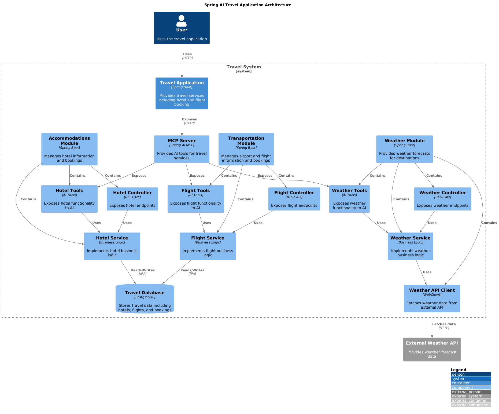
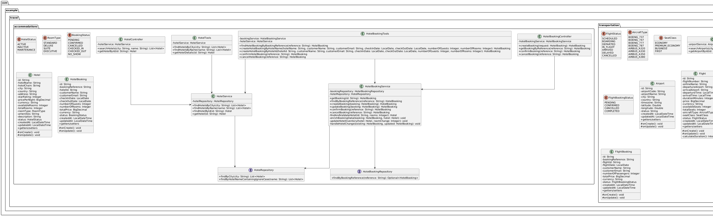
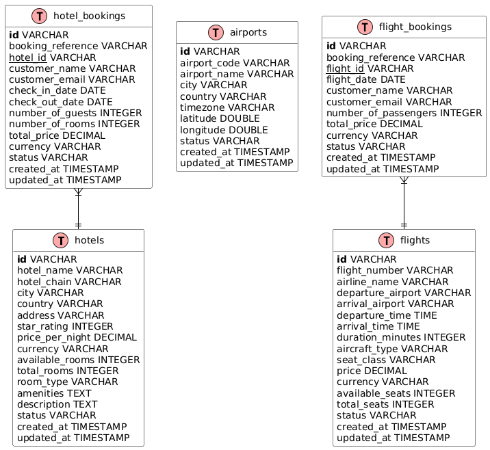

# Spring AI Travel Application

A comprehensive travel management application built with Spring Boot and Spring AI, providing hotel and flight booking capabilities with AI-powered assistance through Model Context Protocol (MCP).

## Project Overview

### Description

The Spring AI Travel Application is a demonstration of how to build modern travel services with AI integration. It provides a complete set of APIs for managing travel-related activities including:

- Hotel search and booking
- Flight search and booking
- Weather forecasts for destinations

The application follows Domain-Driven Design (DDD) principles and showcases best practices for building Spring Boot applications with AI capabilities.

### Purpose

This application serves as:

1. A reference implementation for Spring AI integration in business applications
2. A demonstration of Model Context Protocol (MCP) for extending AI capabilities
3. A practical example of domain-driven design in a travel domain
4. A showcase for building modular, maintainable Spring Boot applications

### Technology Stack

- **Java 21**: Latest LTS version with modern language features
- **Spring Boot 3.5.7**: Core framework for building the application
- **Spring AI 1.0.3**: AI integration with Model Context Protocol (MCP)
- **Spring Data JPA**: Data access layer with Hibernate
- **PostgreSQL**: Database for storing travel data
- **Testcontainers 1.21.3**: Automatic database container management for development and testing
- **Spring WebFlux**: Reactive programming for external API calls
- **Docker**: Containerization for database and application

## Quick Start

```bash
# Clone and navigate to the project
cd travel/

# Run with automatic PostgreSQL container
mvn spring-boot:test-run

# Application available at http://localhost:8082
```

## Getting Started

### Prerequisites

- Java 21 or higher
- Maven 3.8 or higher
- Docker (for Testcontainers - PostgreSQL is automatically managed)
- No manual PostgreSQL setup required

### Running the Application

The application uses **Testcontainers** for automatic PostgreSQL database management during development and testing. No manual database setup is required.

#### Development Mode

```bash
cd travel/
mvn spring-boot:test-run
```

This will:
- Automatically start a PostgreSQL 16 container using Testcontainers 1.21.3
- Initialize the database with sample data from SQL scripts
- Start the application on http://localhost:8082
- Clean up the container when the application stops

#### Production Mode

```bash
cd travel/
mvn spring-boot:run
```

For production, configure your PostgreSQL connection in `application.properties`.

#### Database Structure

The travel database contains the following main tables:

1. **Hotels**: Comprehensive hotel information
2. **Hotel_Bookings**: Hotel reservation details
3. **Airports**: Airport information with location data
4. **Flights**: Flight schedules and availability
5. **Flight_Bookings**: Flight reservation details

#### Sample Data

The database is pre-populated with:
- Over 100 hotels across major cities
- Major international airports
- Sample flights between popular destinations

### Building and Testing

1. Build the application:
   ```bash
   cd travel/
   mvn clean package
   ```

2. Run tests (includes Testcontainers integration tests):
   ```bash
   mvn test
   ```

3. The application will be available at:
   ```
   http://localhost:8082
   ```

### Testing the API

The project includes comprehensive test scripts to verify API functionality:

```bash
cd travel/scripts/
./test-api-hotels.sh    # Test hotel-related endpoints
./test-api-flights.sh   # Test flight-related endpoints
./test-api-weather.sh   # Test weather forecast endpoints
```

All tests run against the live application with Testcontainers-managed PostgreSQL database.

## Architecture

The application follows a layered architecture with clear separation of concerns:

### Domain Model

The domain model is organized around two main bounded contexts:

1. **Accommodations**: Hotels and hotel bookings
2. **Transportation**: Airports, flights, and flight bookings

Additionally, there's a supporting Weather service for destination forecasts.

### Layered Architecture

Each domain follows a standard layered architecture:

1. **Controller Layer**: REST API endpoints
2. **Service Layer**: Business logic and transaction management
3. **Repository Layer**: Data access using Spring Data JPA
4. **Entity Layer**: Domain model with JPA annotations
5. **Tools Layer**: AI-specific functionality exposed via MCP

### AI Integration

The application integrates with AI systems through:

1. **MCP Server**: Exposes domain functionality as AI tools
2. **Tool Annotations**: Marks methods for AI consumption
3. **Parameter Handling**: Validates and processes AI requests
4. **Response Formatting**: Structures responses for AI consumption

### Component Architecture



### Class Diagram



### Database Schema



## API Documentation

### Hotel API

#### Search Hotels
```
GET /api/hotels/search?city={city}&name={name}&checkInDate={yyyy-MM-dd}&numberOfNights={nights}
```
Parameters:
- `city`: (Optional) City name to search for hotels
- `name`: (Optional) Hotel name to search for
- `checkInDate`: (Optional) Check-in date in format yyyy-MM-dd
- `numberOfNights`: (Optional) Number of nights to stay

#### Get Hotel by ID
```
GET /api/hotels/{id}
```
Parameters:
- `id`: UUID of the hotel

#### Create Hotel Booking
```
POST /api/hotel-bookings
Content-Type: application/json

{
  "hotelId": "uuid",
  "customerName": "John Doe",
  "customerEmail": "john@example.com",
  "checkInDate": "2025-07-15",
  "checkOutDate": "2025-07-20",
  "numberOfGuests": 2,
  "numberOfRooms": 1
}
```
Parameters:
- `hotelId`: UUID of the hotel to book
- `customerName`: Full name of the customer
- `customerEmail`: Email address of the customer
- `checkInDate`: Check-in date in format yyyy-MM-dd
- `checkOutDate`: Check-out date in format yyyy-MM-dd
- `numberOfGuests`: Number of guests staying
- `numberOfRooms`: Number of rooms to book

#### Get Hotel Booking
```
GET /api/hotel-bookings/{bookingReference}
```
Parameters:
- `bookingReference`: Unique booking reference code (e.g., HTL123456)

#### Confirm Hotel Booking
```
PUT /api/hotel-bookings/{bookingReference}/confirm
```
Parameters:
- `bookingReference`: Unique booking reference code

#### Cancel Hotel Booking
```
PUT /api/hotel-bookings/{bookingReference}/cancel
```
Parameters:
- `bookingReference`: Unique booking reference code

### Flight API

#### Search Airports
```
GET /api/airports/search?city={city}&code={code}
```
Parameters:
- `city`: (Optional) City name to search for airports
- `code`: (Optional) Airport code (e.g., LHR for London Heathrow)

#### Search Flights
```
GET /api/flights/search?departureCity={departureCity}&arrivalCity={arrivalCity}&flightNumber={flightNumber}
```
Parameters:
- `departureCity`: (Optional) Departure city name
- `arrivalCity`: (Optional) Arrival city name
- `flightNumber`: (Optional) Flight number (e.g., BA102)

#### Get Flight by ID
```
GET /api/flights/{id}
```
Parameters:
- `id`: UUID of the flight

#### Create Flight Booking
```
POST /api/flight-bookings
Content-Type: application/json

{
  "flightId": "uuid",
  "flightDate": "2025-08-15",
  "customerName": "John Doe",
  "customerEmail": "john@example.com",
  "numberOfPassengers": 2
}
```
Parameters:
- `flightId`: UUID of the flight to book
- `flightDate`: Date of the flight in format yyyy-MM-dd
- `customerName`: Full name of the customer
- `customerEmail`: Email address of the customer
- `numberOfPassengers`: Number of passengers for this booking

#### Get Flight Booking
```
GET /api/flight-bookings/{bookingReference}
```
Parameters:
- `bookingReference`: Unique booking reference code (e.g., FLT123456)

#### Confirm Flight Booking
```
PUT /api/flight-bookings/{bookingReference}/confirm
```
Parameters:
- `bookingReference`: Unique booking reference code

#### Cancel Flight Booking
```
PUT /api/flight-bookings/{bookingReference}/cancel
```
Parameters:
- `bookingReference`: Unique booking reference code

### Weather API

#### Get Weather Forecast
```
GET /api/weather?city={city}&date={date}
```
Parameters:
- `city`: Name of the city for weather forecast
- `date`: Date for the forecast in format yyyy-MM-dd (can be past, present, or future)

## AI Tools

The application exposes the following AI tools through the MCP server:

### Hotel Tools
- `findHotelsByCity`: Search for hotels in a specific city
- `findHotelsByName`: Search for hotels by name
- `getHotelDetails`: Get detailed information about a hotel by ID
- `createHotelBookingByHotelName`: Book a hotel by name with customer details and dates
- `createHotelBookingByHotelId`: Book a hotel by ID with customer details and dates
- `findHotelBookingByBookingReference`: Get details of a hotel booking by reference
- `confirmHotelBooking`: Confirm a pending hotel booking
- `cancelHotelBooking`: Cancel an existing hotel booking

### Flight Tools
- `findAirportsByCity`: Search for airports in a specific city
- `findAirportByCode`: Find an airport by its code (e.g., LHR)
- `findFlightsByRoute`: Search for flights between departure and arrival cities
- `getFlightDetails`: Get detailed information about a flight by number
- `createFlightBooking`: Book a flight with customer details and number of passengers
- `findFlightBookingByBookingReference`: Get details of a flight booking by reference
- `confirmFlightBooking`: Confirm a pending flight booking
- `cancelFlightBooking`: Cancel an existing flight booking

### Weather Tools
- `getWeatherForecast`: Get weather forecast for a city on a specific date
- `cancelBooking`: Cancel a hotel booking

### Flight Tools
- `searchAirports`: Search for airports by city or code
- `getAirportDetails`: Get detailed information about an airport
- `searchFlights`: Search for flights between airports
- `getFlightDetails`: Get detailed information about a flight
- `bookFlight`: Create a flight booking
- `getFlightBookingDetails`: Get details of a flight booking
- `cancelFlightBooking`: Cancel a flight booking

### Weather Tools
- `getWeatherForecast`: Get weather forecast for a city

## Best Practices

The application demonstrates several best practices:

### Domain-Driven Design
- Clear bounded contexts
- Rich domain models
- Value objects for complex attributes
- Domain services for business logic

### API Design
- RESTful endpoints
- Consistent error handling
- Proper HTTP status codes
- Resource-oriented URLs

### Transaction Management
- Service-level transactions
- Read vs. write operation separation
- Optimistic locking for concurrency

### Testing
- Unit tests for business logic
- Integration tests with Testcontainers
- API tests for controllers
- Automated test scripts for end-to-end validation

## Database Configuration

### Testcontainers Integration

The application uses **Testcontainers** for automatic database management:

- **Development**: `mvn spring-boot:test-run` automatically starts PostgreSQL 16 container
- **Testing**: Integration tests use `@ServiceConnection` for seamless container management
- **No manual setup**: Database schema and sample data are automatically initialized

### Configuration Files

- `TestcontainersConfiguration.java`: Configures PostgreSQL container with `@ServiceConnection`
- `application-test.properties`: Test-specific database configuration
- `AbstractIntegrationTest.java`: Base class for integration tests

### Database Initialization

The database is automatically initialized with sample data from:

1. `init-travel-db.sql`: Creates the travel_db schema
2. `init-travel-hotels.sql`: Populates hotels and hotel bookings
3. `init-travel-flights.sql`: Populates airports and flights

### Production Configuration

For production deployment, configure PostgreSQL connection in `application.properties`:

```properties
spring.datasource.url=jdbc:postgresql://your-host:5432/travel_db
spring.datasource.username=your-username
spring.datasource.password=your-password
spring.jpa.hibernate.ddl-auto=validate
```

## Development Features

### Modern Spring Boot Setup
- **Spring Boot 3.5.7**: Latest stable version with enhanced features
- **Spring AI 1.0.3**: Cutting-edge AI integration capabilities
- **Testcontainers 1.21.3**: Seamless container-based testing
- **Java 21**: Modern language features and performance improvements

### Testing Infrastructure
- **Automated Database Management**: No manual PostgreSQL setup required
- **Integration Test Base**: `AbstractIntegrationTest` for consistent test setup
- **API Test Scripts**: Comprehensive endpoint validation
- **Container Lifecycle**: Automatic cleanup and resource management

## Future Enhancements

- Add user authentication and authorization
- Implement payment processing
- Add travel packages combining flights and hotels
- Integrate with external booking systems
- Add more AI capabilities for travel recommendations
- Deploy to AWS with containerization
- Add monitoring and observability features

## Contributing

Contributions are welcome! Please feel free to submit a Pull Request.

## License

This project is licensed under the MIT License - see the LICENSE file for details.
